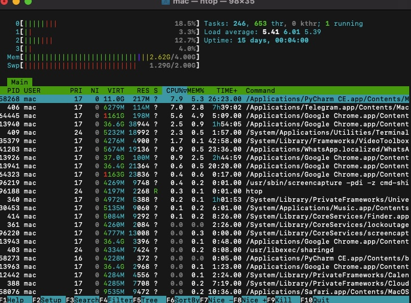

# Абакар Иссака Малли 
К3141 
ИСУ: 464893 
# Тема: Контроль/Мониторинг ресурсов 

# Лабораторная работа: Мониторинг ресурсов системы

## Описание
Цель данной лабораторной работы — научиться мониторить использование ресурсов системы (ЦПУ, память, диск) с помощью встроенных утилит и команд. Это поможет лучше понимать, как управлять ресурсами и выявлять проблемы.

---

## Упражнение 1: Использование `htop` для мониторинга ресурсов

### Шаги:

1. **Откройте терминал**
   - На macOS: Используйте приложение **Терминал**.
   - На Linux: Нажмите `Ctrl + Alt + T`.

2. **Установите `htop` (если он не установлен)**  
   - На macOS:  
     ```bash
     brew install htop
     ```
   - На Ubuntu:  
     ```bash
     sudo apt update
     sudo apt install htop
     ```

3. **Запустите `htop`**  
   Введите команду:  
   ```bash
   htop
   ```

4. **Просмотрите информацию о системе**  
   - Состояние процессора, использование памяти, активные процессы.

5. **Закройте `htop`**  
   Нажмите `F10` или `q`.

### Пример вывода:

Вот как выглядит `htop` в терминале:



---

## Упражнение 2: Использование команды `vm_stat`

### Шаги:

1. **Откройте терминал**  
   - На macOS или Linux.

2. **Введите команду `vm_stat`**  
   ```bash
   vm_stat
   ```

3. **Интерпретируйте результаты**  
   - Обратите внимание на строки, описывающие использование памяти.
   - Например, `Pages free` указывает количество свободной памяти.

### Пример вывода:

Вот пример результата команды `vm_stat`:


---

## Скрипт: Генерация отчёта о системе

Для автоматизации мониторинга создайте следующий скрипт:

### Шаги:

1. **Создайте файл `system_report.sh` в папке `scripts/`.**

2. **Добавьте следующий код:**
   ```bash
   #!/bin/bash

   echo "Системный отчёт" > system_report.txt
   echo "Дата: $(date)" >> system_report.txt
   echo "" >> system_report.txt

   echo "Использование процессора:" >> system_report.txt
   top -l 1 | grep "CPU usage" >> system_report.txt
   echo "" >> system_report.txt

   echo "Состояние памяти:" >> system_report.txt
   vm_stat >> system_report.txt
   echo "" >> system_report.txt

   echo "Использование диска:" >> system_report.txt
   df -h >> system_report.txt

   echo "Отчёт успешно создан в файле system_report.txt"
   ```

3. **Сделайте файл исполняемым:**
   ```bash
   chmod +x scripts/system_report.sh
   ```

4. **Запустите скрипт:**
   ```bash
   ./scripts/system_report.sh
   ```

5. **Проверьте результат в файле `system_report.txt`**.

---

## Ссылки

- [Документация htop](https://htop.dev/)
- [Статья о vm_stat](https://ss64.com/osx/vm_stat.html)
- [Утилита df](https://linux.die.net/man/1/df)

